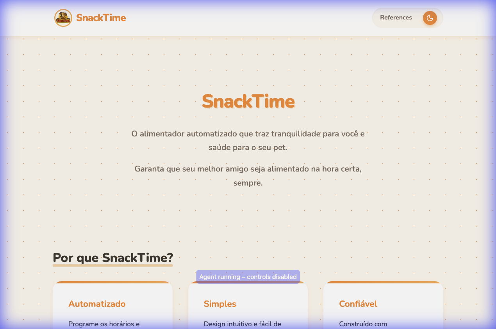

# SnackTimeWebSite# 🐶 SnackTime
> **Seu pet alimentado na hora certa, sempre.**
O **SnackTime** é um projeto de alimentador automatizado desenvolvido com Arduino, focado em trazer tranquilidade para os donos e saúde para os pets. Este repositório contém o site de documentação e apresentação do produto.

## ✨ Funcionalidades
- **Design Amigável**: Interface "Playful" pensada para o universo pet.
- **Modo Noturno**: Tema escuro automático e manual para conforto visual.
- **Documentação Técnica**: Explicação detalhada do código Arduino utilizado.
- **Responsivo**: Funciona bem em computadores e celulares.
## 🛠️ Tecnologias Utilizadas
- **HTML5**: Estrutura semântica.
- **CSS3**:
  - Variáveis CSS (Custom Properties).
  - Flexbox e Grid Layout.
  - Design System próprio (cores, tipografia 'Nunito', sombras).
- **JavaScript (Vanilla)**: Lógica de troca de tema e navegação.
- **Arduino**: Lógica de controle do servo motor (documentada no site).
## 🚀 Como Rodar
1. Clone este repositório:
   ```bash
   git clone https://github.com/seu-usuario/ProjetoSnackTime.git
   ```
2. Abra o arquivo `index.html` no seu navegador preferido.
## 📂 Estrutura do Projeto
```
ProjetoSnackTime/
├── css/
│   └── styles.css      # Estilos globais e temas
├── js/
│   └── script.js       # Lógica do site
├── images/
│   ├── logo.jpg        # Logo do produto
│   └── preview.png     # Screenshot do projeto
├── index.html          # Página Inicial
├── references.html     # Página de Referências Técnicas
└── README.md           # Este arquivo
```
## 📝 Licença
Este projeto foi desenvolvido para fins acadêmicos.
---
